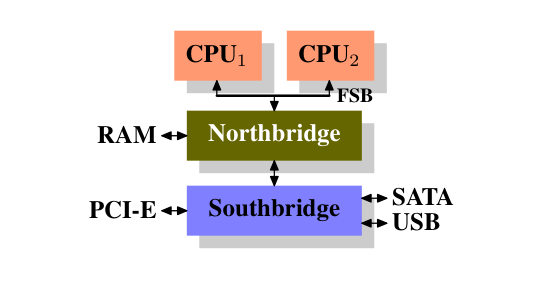

# What Every Programmer Should Know About Memory
## Abstract

随着 cpu 核心的速度和数量越来越多，现在以及之后一段时间内对大多数程序员的限制因素会是内存访问。硬件设计师带来了越来越多的内存处理和加速技术——例如 CPU 缓存——但是这些东西在没有程序员的帮助下不能工作在最优状态。不幸的是，大多数程序员都不是很理解计算机或者 CPUs 缓存的结构以及使用内存子系统的成本。这篇论文解释了用在现代商品硬件上的内存子系统结构，说明了为什么要开发 CPU 缓存，它们如何工作，并且程序员需要通过利用它们做什么来实现优化性能。

## 1. Introduction

在早些时候计算机是很简单。计算机的各种组件，例如 CPU、内存、大容量存储器和网络接口，是一起发明的，所以在性能上很平衡。例如，内存和网络接口在提供数据上比 CPU 快不了多少。

在计算机结构稳定了并且硬件设计师集中优化单独子系统后，这种情况改变了。突然计算机的一些组件的性能显著落后并且成为瓶颈。尤其是大容量存储和内存子系统，因为成本原因，其相比其他组件提升缓慢。

大容量存储的缓慢大多通过软件技术解决了：操作系统把最经常使用的（并且更可能被使用的）数据保存在主内存中，其速度比其他硬盘快几个数量级。缓存被加在存储设备上，这无需操作系统做变动就能提升性能。由于这篇论文主题的原因，我们不会深入软件优化大容量存储读取的更多细节。

不像存储系统，移除内存瓶颈被被证明是更难的并且基本所有解决方案都需要硬件做出修改。如今的修改主要在以下形式：

* RAM 硬件设计（速度和并行性）。
* 内存控制器设计。
* CPU 缓存
* 设备直接访问内存（DMA）

这篇文档的大部分内容是关于 CPU 缓存和内存控制器设计的一些影响。在探索这些主题的过程中，我们会探究 DMA 并且把它带入整体上看。不过，我们会先从一个现在的商品硬件设计概述开始。这是理解使用有效使用内存子系统的问题和限制的前提。我们还会了解到一些细节，如 RAM 的不同类型并说明为什么仍然存在这些类型。

这篇文档绝非包罗万象，也非最终版本。这仅限于商品硬件，并且仅限于商品硬件的一个子集。并且，为了这篇论文的目的，许多主题只会讨论必要的细节。对于这些主题，建议读者去查找更详细的文档。

当谈到操作系统特定的细节和解决方案时，特定指的是 Linux。在任何时候都不会包含其他操作系统的信息。如果读者认为他们必须使用别的操作系统时，他们需要找他们的供应商，要求他们写一个和本文类似的文档。

在开始前最后一句话。本文包含许多像 “usually” 一样的限定词。这里讨论的技术在现实世界中有许多变体，这篇文章只定位于那些最通用，最主流的版本。关于这些技术鲜有绝对的声明，所以有这些限定词。

### Document Structure

这个文档基本是给软件开发者的。这里的技术细节对硬件方向的读者不够有用。但是在我们可以进入到对开发者实用的信息之前，还有许多基础工作要做。

在这结束后，第二章在技术细节上描述了随机访问内存（RAM）。这章的内容如果知道那很好，但对于后面的章节不是绝对关键的。对于需要这些内容的地方都有合适的返回引用，所以那些会读附录的读者一开始可以跳过这章的大部分内容。

第三章开始很多 CPU 内存行为的细节。如果只有文字的话会很枯燥，所以添加了图片。这章的内容对理解剩下的内容是必要的。第四章简要描述了虚拟内存是如何实现的。这也是剩下内容需要的基础。

第五章开始许多关于非统一内存访问（NUMA）系统的许多细节。

第六章是这篇论文的中心章节。它把前面所有章节的信息合在一起，并在如何在多种情况下写出良好性能的代码方面给程序员提出建议。非常没有耐心的读者可以从这一章开始，并且如果必要的话再回到之前的章节学习低层技术的知识。

第七章介绍了能帮程序员做得更好的工具。即使完全了解了技术，再一个复杂项目里也很难发现问题在哪。

在第八章我们最后对不久的将来可能会出现的技术，或者仅仅是很好的技术进行展望。

### Reporting Problems

...

### Thanks

...

### About this Document

这篇文章的标题是对 David Doldberg 的经典文章 "What Every Computer Scientist Should Know About Floating-Point Arithmetic" 的致敬。这篇文章仍然没有广为人知，尽管它应该作为任何想敲键盘做严肃编程的人的必备条件。

...

## 2. Commodity Hardware Today

理解商品硬件很重要，因为特殊硬件正在退出。现在更经常横向地实现拓展而不是纵向，意味着现在通过使用许多更小的，连接起来的商用计算器来拓展会更划算，而不是使用少量很大并且特别快（也特别贵）的系统。之所以这样是因为快又不贵的网络硬件是广泛可用的。在某些请跨大型特定系统仍占有一席之地，并且这些系统仍提供商业机会，但整体市场和相比相形见绌。Red Hat 在 2007 年预测未来的产品，对大多数数据中心的“标准构建块”会是一个有着多达四个槽位，每个槽位放置一个四核 CPU 并且如果是 Intel 的 CPU 的话会有超线程。这意味着在数据中心的标准系统会有多达 64 个虚拟处理器。更大的机器会被支持，但是四槽位，四核 CPU 方案是目前认为的甜品点并且大多优化是以这种机器为目标。

在用商品零件构建的计算机结构中存在很大差异。即便如此，只要关心最重要的差异我们就能覆盖 90% 此类硬件。要注意的是，这些技术细节变化很快，所以建议读者考虑本文撰写的时间。

多年来个人计算机和小型服务器的芯片组标准化为两部分：北桥和南桥。下图展示了这种结构。

所有 CPU（上面的例子是两个，但是可以是更多）是通过一个通用总线（前侧总线）连接到北桥。

